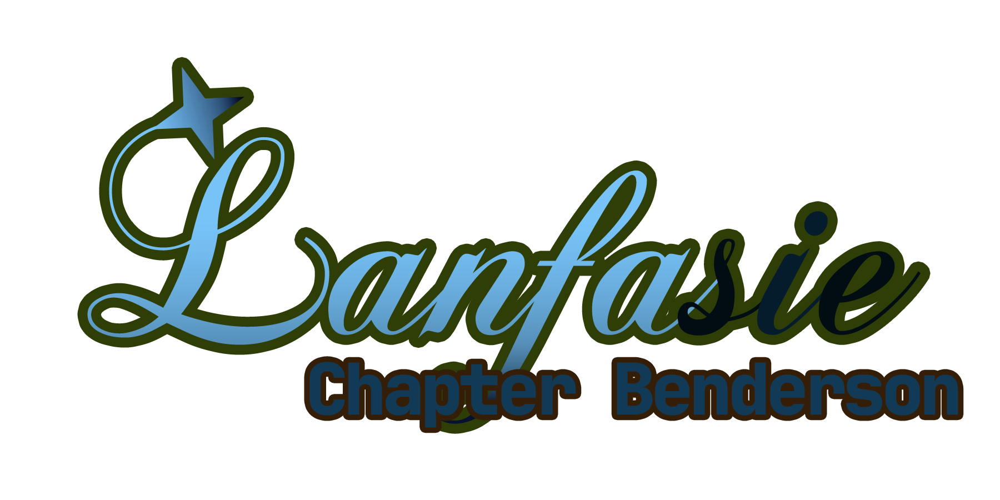

# Lanfasie: Chapter Benderson

This the repo of Minecraft Mod "Lanfasie: Chapter Benderson"

## What is this mod?
> New threatful boss introduced into the game! With new interesting boss mechanics, can you survive from his attack, and save him from the twisted "deep latent"?

This is a lore-oriented mod, about a story of Benderson, the Abyss-sunken Dawn-waiter.

## License
All codes in this repo are licensed under MIT License [(./LICENSE)](./LICENSE), unless other specified.

All non-code assets in this repo are under License [(./ASSETS_LICENSE)](./ASSETS_LICENSE).

